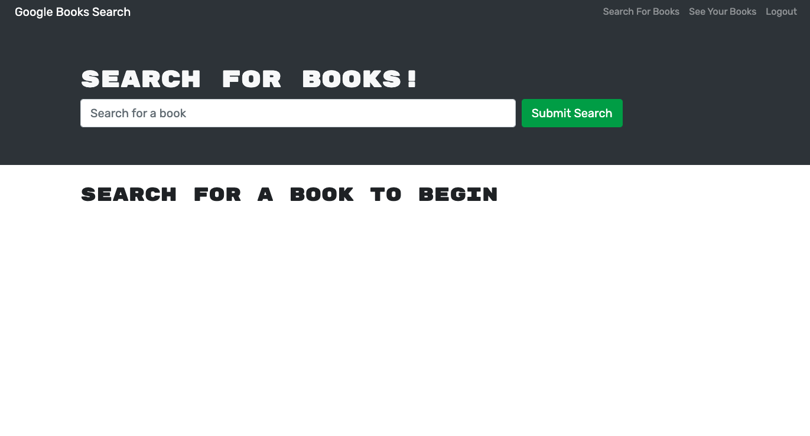
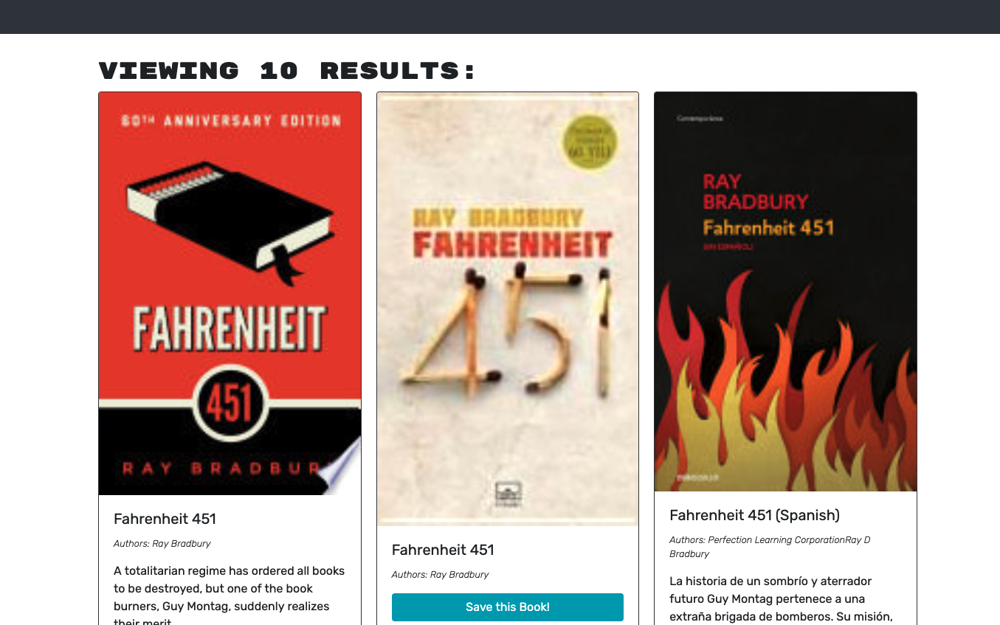

# MERN: Book Search Engine


<a name="description"></a>
## Description
The purpose of this application was to integrate the MERN technologies MongoDB, Express, ReactJS, and NodeJS in order to create a book search engine where a user can search for books they are interested in reading and saving them to a list. This project also uses GraphQL to handle the queries and mutations from the database.  


[](https://opensource.org/licenses/MIT)

## Table of Contents
- [Description](#description)
- [User Story](#userstory)
- [Acceptance Criteria](#acceptancecriteria)
- [Installation](#installation)
- [Usage](#usage)
- [License](#license)
- [Contributing](#contributing)
- [Tests](#tests)
- [Questions](#questions)
- [Screenshots](#screenshots)
- [Links](#links)
- [Resources / Credits](#credits)


<a name="userstory"></a>

## User Story

```md
AS AN avid reader
I WANT to search for new books to read
SO THAT I can keep a list of books to purchase
```

<a name="acceptancecriteria"></a>

## Acceptance Criteria

```md
GIVEN a book search engine
WHEN I load the search engine
THEN I am presented with a menu with the options Search for Books and Login/Signup and an input field to search for books and a submit button
WHEN I click on the Search for Books menu option
THEN I am presented with an input field to search for books and a submit button
WHEN I am not logged in and enter a search term in the input field and click the submit button
THEN I am presented with several search results, each featuring a book’s title, author, description, image, and a link to that book on the Google Books site
WHEN I click on the Login/Signup menu option
THEN a modal appears on the screen with a toggle between the option to log in or sign up
WHEN the toggle is set to Signup
THEN I am presented with three inputs for a username, an email address, and a password, and a signup button
WHEN the toggle is set to Login
THEN I am presented with two inputs for an email address and a password and login button
WHEN I enter a valid email address and create a password and click on the signup button
THEN my user account is created and I am logged in to the site
WHEN I enter my account’s email address and password and click on the login button
THEN I the modal closes and I am logged in to the site
WHEN I am logged in to the site
THEN the menu options change to Search for Books, an option to see my saved books, and Logout
WHEN I am logged in and enter a search term in the input field and click the submit button
THEN I am presented with several search results, each featuring a book’s title, author, description, image, and a link to that book on the Google Books site and a button to save a book to my account
WHEN I click on the Save button on a book
THEN that book’s information is saved to my account
WHEN I click on the option to see my saved books
THEN I am presented with all of the books I have saved to my account, each featuring the book’s title, author, description, image, and a link to that book on the Google Books site and a button to remove a book from my account
WHEN I click on the Remove button on a book
THEN that book is deleted from my saved books list
WHEN I click on the Logout button
THEN I am logged out of the site and presented with a menu with the options Search for Books and Login/Signup and an input field to search for books and a submit button  
```

<a name="installation"></a>

## Installation
* Clone the repository using:

```
git clone https://github.com/jonteal/book-search-engine
```
* Be sure that you are in the current working directory
* Create a .env file. (See below in Usage for how to set up.)
* Install the dependencies (express, mongoose, and moment) by opening the terminal and running...
```
npm install OR npm i
```

* Next, run the project by typing the following command in the terminal:
```
npm run develop
```

<a name="usage"></a>

## Usage
* In order to use the application, the user needs to use an API client such as Insomnia, or any other similar tool. Routes for the Users, Friends, Thoughts, and Reactions below:


<a name="license"></a>

## License
Permission is hereby granted, free of charge, to any person obtaining a copy of this software and associated documentation files (the "Software"), to deal in the Software without restriction, including without limitation the rights to use, copy, modify, merge, publish, distribute, sublicense, and/or sell copies of the Software, and to permit persons to whom the Software is furnished to do so, subject to the following conditions:

The above copyright notice and this permission notice shall be included in all copies or substantial portions of the Software.

THE SOFTWARE IS PROVIDED "AS IS", WITHOUT WARRANTY OF ANY KIND, EXPRESS OR IMPLIED, INCLUDING BUT NOT LIMITED TO THE WARRANTIES OF MERCHANTABILITY, FITNESS FOR A PARTICULAR PURPOSE AND NONINFRINGEMENT. IN NO EVENT SHALL THE AUTHORS OR COPYRIGHT HOLDERS BE LIABLE FOR ANY CLAIM, DAMAGES OR OTHER LIABILITY, WHETHER IN AN ACTION OF CONTRACT, TORT OR OTHERWISE, ARISING FROM, OUT OF OR IN CONNECTION WITH THE SOFTWARE OR THE USE OR OTHER DEALINGS IN THE SOFTWARE.


<a name="contributing"></a>

## How to Contribute
1. [Fork the repo!](https://docs.github.com/en/get-started/quickstart/fork-a-repo)
2. Create a feature branch:
```
git checkout -b yourname-branch
```
3. Commit changes:
```
git commit -m 'Your changes here'
```
4. Push to the branch:
```
git push origin yourname-branch
```
5. Submit a pull request and wait for it to be approved or denied.

<a name="tests"></a>

## Tests
No tests available at this time.


<a name="questions"></a>

## Questions
If you have any questions or comments, please feel free to contact me by email:

* Jon Jackson - jonjackson.webdesign@gmail.com


<a name="screenshots"></a>

## Screenshots


#### Homescreen


#### Book Search



<a name="links"></a>

## Links
Github Repository: https://github.com/jonteal/book-search-engine


<a name="credits"></a>

## Resources / Credits
This project was authored by: 
* Jon Jackson - https://github.com/jonteal

Development of the project utilized npm dependencies: MongoDB, Express, ReactJS, NodeJS, GraphQL.